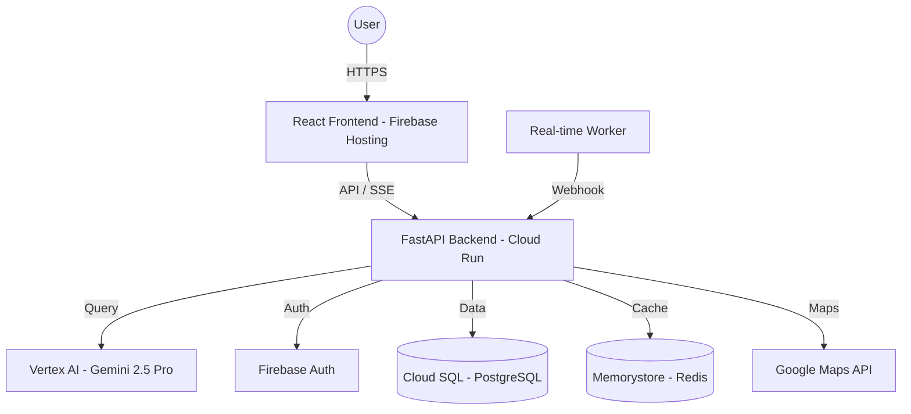

# WanderAI: Intelligent Travel Experience Engine

WanderAI is a production-grade travel planning application that leverages **Gemini 2.5 Pro** to generate real-time, streaming itineraries. It features a conversational modification interface, real-time disruption handling, and a premium, glassmorphic UI.

---

## 🏗️ Architecture



---

## ✨ Key Features

- **Streaming Itineraries (SSE)**: Watch your trip plan "type itself out" in real-time as the AI generates it. No more waiting for minutes at a spinning loader.
- **Conversational Refinement**: Use the built-in AI Chat Assistant to modify your trip (e.g., *"Make Day 2 more budget-friendly"* or *"Add more outdoor activities"*).
- **Real-Time Reactivity**: Simulates real-world data (weather, flight delays) to trigger immediate itinerary adjustments.
- **Production-Ready Security**: 
    - Full **Firebase Authentication** with Google Sign-In.
    - OWASP security headers, Rate Limiting, and CORS protection.
    - Managed secrets via **GCP Secret Manager**.
- **Modern UI**: Fully responsive, glassmorphic design built with Vanilla CSS and Lucide React.

---

## 🚀 Tech Stack

### Backend
- **Framework**: Python 3.12+ / FastAPI
- **AI**: Google Vertex AI (Gemini 2.5 Pro)
- **Database**: PostgreSQL (SQLAlchemy ORM)
- **Real-time**: Server-Sent Events (SSE)
- **Security**: Firebase Admin SDK, Pydantic (Settings/Validation)

### Frontend
- **Framework**: React 18+ / Vite / TypeScript
- **State Management**: TanStack Query (React Query)
- **Styling**: Vanilla CSS (Custom Design System)
- **Icons**: Lucide React
- **Notifications**: React Hot Toast

### Infrastructure (GCP)
- **Compute**: Cloud Run
- **Storage**: Cloud SQL, Firebase Hosting
- **Cache**: Memorystore for Redis
- **CI/CD**: Cloud Build
- **IaC**: Terraform

---

## 🛠️ Setup & Installation

### Prerequisites
- Node.js 22+
- Python 3.12+
- Terraform
- Google Cloud SDK (gcloud)

### 1. Backend Setup
```bash
cd backend
python -m venv venv
source venv/bin/activate  # venv\Scripts\activate on Windows
pip install -r requirements.txt
cp .env.example .env      # Fill in your GCP/Maps keys
uvicorn app.main:app --reload
```

### 2. Frontend Setup
```bash
cd frontend
npm install
cp .env.example .env      # Set your Firebase/API config
npm run dev
```

### 3. Infrastructure
```bash
cd infra
terraform init
terraform plan
terraform apply
```

---

## 🧪 Testing

- **Backend**: `pytest tests/`
- **Frontend**: `npm run test`

---

## 📜 Deployment

The project is configured for automated deployment via **Cloud Build**:
- Backend deployments trigger via `backend/cloudbuild.yaml`.
- Frontend deployments to Firebase Hosting trigger via `frontend/cloudbuild.yaml`.

---

## 🌐 Live Demos

- **Frontend**: [https://solid-altar-495705-q5.web.app](https://solid-altar-495705-q5.web.app)
- **Backend API**: [https://travel-engine-backend-258840388638.us-central1.run.app/api/v1](https://travel-engine-backend-258840388638.us-central1.run.app/api/v1)

---

Developed with ❤️ by the WanderAI Team.
