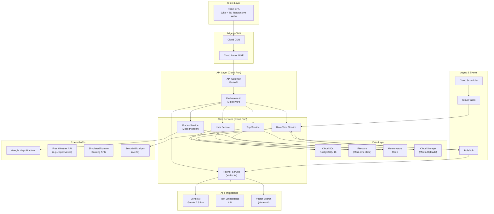
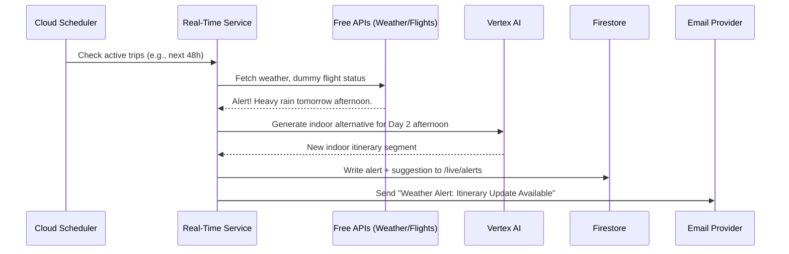

# Travel Planning & Experience Engine — Architecture Plan

## 1. Problem Statement

Build an intelligent travel planning platform that lets users **dynamically plan trips** based on preferences (budget, pace, interests, natural language input), constraints (dates, mobility, dietary), and **real-time contextual updates** (weather, pricing, local events). The system leverages **Vertex AI** for generative itinerary creation and **Google Maps Platform** for spatial intelligence. 

Crucially, the system monitors active itineraries and provides **real-time email alerts** for flight changes, weather events, or unavoidable mishaps, automatically suggesting AI-curated alternatives to maximize the experience.

---

## 2. High-Level Architecture

---

## 3. Technology Decisions

| Layer | Technology | Rationale & Guidelines |
|-------|------------|------------------------|
| **Backend** | **Python 3.12+ / FastAPI** | Async-native, excellent Vertex AI SDK support. |
| **Frontend** | **React 18 + TS + Vite** | Responsive web app for both mobile and PC. No separate React Native app required. |
| **Maps** | **Google Maps Platform** | Cached aggressively via Redis to optimize costs. |
| **AI** | **Vertex AI (Gemini 2.5 Pro)** | Strict safety settings applied to prevent generation of content violating government or safety guidelines. |
| **External Data** | **Free APIs & Dummy Data** | Using free APIs (e.g., OpenMeteo) for weather. Flight/hotel booking APIs will use dummy/simulated data to avoid paid 3rd-party services. |
| **Alerts** | **Email Integration** | Real-time updates (flight times, weather swaps) pushed via email and in-app notifications. |

---

## 4. Service Architecture (Backend Detail)

### 4.1 API Gateway — `gateway-service`
Single FastAPI entry point deployed on Cloud Run. Handles routing, auth, rate limiting, and request validation.

### 4.2 Planner Service — AI Itinerary Engine
Orchestrates Vertex AI for plan generation.
- **Inputs:** Structured UI selections (budget levels, group types like solo/family) combined with **Natural Language** input (e.g., "I want a cheap family trip but we love expensive dinners").
- **Safety:** Content generation prompt includes strict boundaries to respect government guidelines and safety.

### 4.3 Places Service — Maps Platform Proxy
Aggressively caches Google Maps Platform responses in Redis (Memorystore) to **optimize API costs**, keeping expenses as low as possible while maintaining performance.

### 4.4 Real-Time Service
Handles live updates during and after planning. Triggered by Cloud Scheduler periodically checking active trips against current weather/simulated flight data.
- **Logic:** If an unavoidable mishap occurs (e.g., museum closed, storm warning), it calls Vertex AI to generate an alternative plan.
- **Delivery:** Updates Firestore for live UI changes AND triggers an **Email** to the user with the alert and suggested alternative.

---

## 5. Data Model

### 5.1 Cloud SQL (PostgreSQL) — Structured Data
- `users`: Core profile data.
- `trips`: Stores trip metadata, natural language prompts used, budget constraints, and group size (solo, family, etc.).
- `itineraries` & `itinerary_days`: Versioned AI plans.
- `bookings`: Simulated booking records linking to dummy flight/hotel data.

### 5.2 Firestore — Real-Time & Session State
- `/trips/{tripId}/live`: Stores generation progress, real-time alerts, and suggested itinerary swaps.

### 5.3 Redis — Caching Layer
Crucial for cost optimization. Caches Places API data for 24h, routes for 1h.

---

## 6. Frontend Architecture (React)
- **Responsive Web Design:** Fully fluid UI that scales perfectly from desktop to mobile browsers.
- **Input Forms:** Hybrid forms allowing standard selection (sliders, dropdowns) alongside a prominent text area for natural language preference input.
- **State Management:** Zustand (Client), TanStack Query (Server), Firebase SDK (Real-time).

---

## 7. AI / Vertex AI Integration Detail

### 7.1 Prompt Engineering Strategy
- **Budget Optimization:** AI acts as a financial optimizer, ensuring the suggested places align tightly with the user's budget constraints.
- **Safety Guardrails:** System prompts mandate that no illegal, restricted, or guideline-violating locations/activities are recommended.
- **Resilience Planning:** When queried by the Real-Time Service for alternatives, the AI is prompted to minimize disruption to the rest of the day's timeline.

---

## 8. Real-Time Update Mechanism (With Email)

---

## 9. Phased Delivery Roadmap

> [!NOTE]  
> **MVP Scope:** We will focus primarily on building **Phase 1** and **Phase 2** first to deliver the core MVP. Phases 3 and 4 will follow in subsequent iterations.

### Phase 1 — Foundation (MVP)
- [ ] Project scaffolding (backend + frontend + infra)
- [ ] Firebase Auth integration
- [ ] Cloud SQL setup + migrations
- [ ] Trip CRUD API (supporting structured + natural language inputs)
- [ ] Google Maps integration (cached)
- [ ] Responsive UI shell (Mobile & PC)

### Phase 2 — AI Planning Engine (MVP)
- [ ] Vertex AI Gemini integration with safety guardrails
- [ ] Itinerary generation pipeline (budget/preference respecting)
- [ ] Simulated/Dummy booking data integration
- [ ] Itinerary display UI (timeline, day cards, map overlay)

### Phase 3 — Real-Time & Polish (Post-MVP)
- [ ] Real-time update service (weather, dummy flight checks)
- [ ] Email notification integration
- [ ] Explore/discovery page with AI recommendations
- [ ] Semantic search (Vector Search for destination matching)

### Phase 4 — Production Hardening (Post-MVP)
- [ ] Terraform infrastructure-as-code
- [ ] Cloud Build CI/CD pipeline
- [ ] Cloud Armor WAF + security hardening
- [ ] Load testing + performance optimization

---

## 10. Future Development

These features have been noted for future iterations beyond the current roadmap:
1. **Collaborative Planning:** Real-time multi-user editing via Firestore (OT/CRDT).
2. **Offline Support:** PWA implementation with Service Workers to allow travelers to view itineraries without cellular data.
3. **Real Booking Integrations:** Replacing dummy APIs with real aggregators (Amadeus, Stripe, etc.) when the business requires actual transaction processing.
